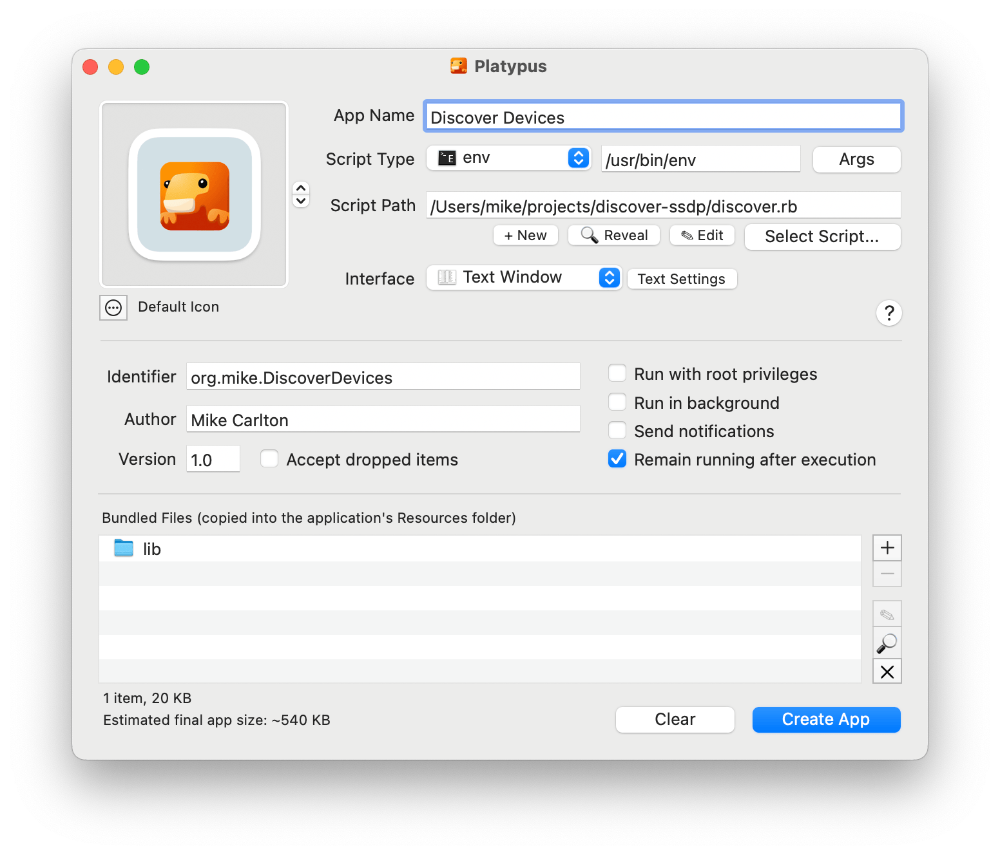
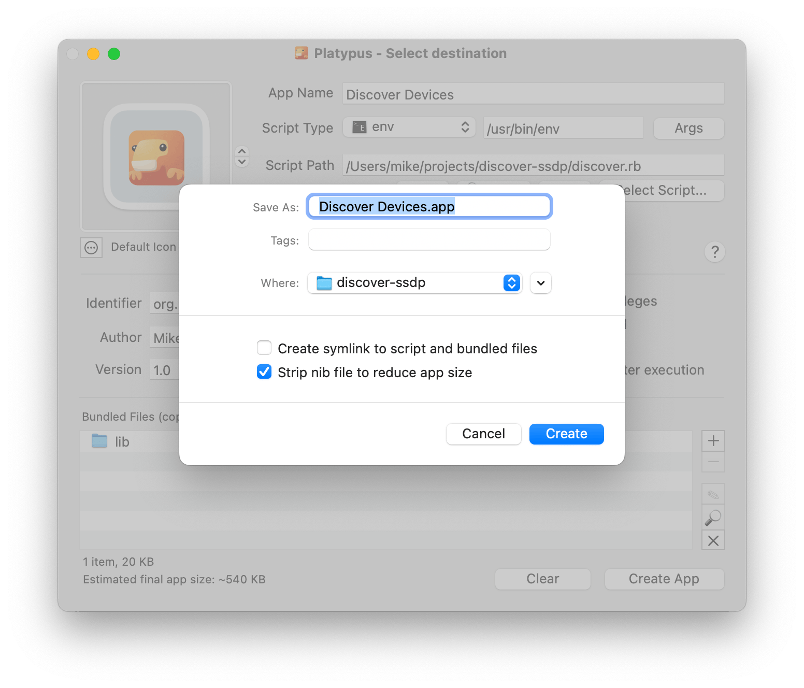

# Intro

A _very_ simple app using SSDP to search for devices on the local network.

Basically just a ruby script that sends a SSDP multicast query and prints the responses.

## SSDP Gem

The [SSDP gem](https://github.com/daumiller/ssdp) is included directly so that we don't
have to do a `bundle install`

Note that you need to comment out (or remove) any `require 'ssdp'` lines.

## Package App with Platypus

Use [Platypus](https://sveinbjorn.org/platypus) ([documentation](https://sveinbjorn.org/files/manpages/PlatypusDocumentation.html)) to build as a Mac application

Set options like this:

and

